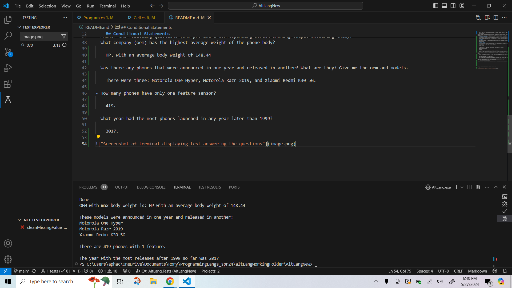

# Alternate Language Project
To run the project: dotnet run --project "src/"
To run the tests: dotnet test

I decided to learn to use C# for this project since I've seen it requested a lot in various internship and job postings in the CS field. From my research, I learned that it is safer and more secure than C and C++, and is somewhat similar to Java in terms of syntax.

The purpose of the project is to read a data file containing information about phone models, clean the data, and process it in order to calculate various pieces of information, eg the company with the highest average weight of phone bodies.

### Object Oriented Programming
C# is an object oriented programming language, similar to Java. It allows the creation of user defined classes, which are a template for instantiated objects. C# supports abstraction, encapsulation, inheritance (but not multiple inheritance), and polymorphism. Access can be private, public, or protected, like in Java, but also internal, protected internal, and private protected. C# also supports abstract classes, interfaces, and sealed classes, which cannot be inherited. Classes can be nested. Immutable records and structs are also supported.

### File Ingesting
File processing is handled by the System.IO namespace, which allows file manipulation and obtaining data about files. File input and output is generally handled as Streams. For example, System.IO.File.ReadLines(path) returns an IEnumerable which can be used with a foreach loop to read a text file one line at a time. The File class includes many high level methods to create and process files while abstracting away the technical complexity.

### Conditional Statements
C# provides standard conditional statements, including if, else if, and else, as well as a shorthand ternary operator (condition ? yes : no). C# also has a switch case. Each case must end with a break; or the code will not compile, so there is no fall through to multiple cases, which improves reliability. The default clause at the end is optional.

### Assignment Statements
Data types should be declared, with a question mark after the type if null is allowed, eg int?. An assignment is structured: type varname = value;. Shorthand compound assignments (op=) are provided, including +=, -=, etc. Assignment is right associative, so a = b = c is really a = (b = c). With value types, the content is copied, and with reference types, the reference is copied. Null coalescing operator a ??= b will assign the right to the left only if the left is null.

### Iteration
C# supports for loops, which execute while the condition is true and count is within range, foreach loops, which execute once for every element in the collection, while loops, which execute until the condition becomes false, and do while loops, which are guaranteed to execute at least once. The keyword break; exits the loop. The keyword continue; exits the current iteration but continues the loop.

### Subprograms
C# is object oriented, so every instruction is performed as part of a method. The Main method is the entry point for the application and is called when the program is started. Main contains all top level statements. Other methods must be declared within a class, struct, or interface. The method must declare access level (eg public), optional modifiers, return value type, name, and parameter names and types eg public static string MyMethod(int param1, bool param2) {...}. To access a method, dot notation is used. To pass a value type by reference, the ref keyword is used, otherwise it is passed by value.

### Unit Testing
There are four different unit testing libraries that are widely used for C# projects. XUnit, which I used, is said to be modern and easy to use, and is commonly used for .NET project testing. NUnit is an older testing library used for many legacy C# projects. MSTest is backed by Microsoft and integrated into the Visual Studio line tools. Moq is specifically used for creating mock objects for isolated unit testing of classes with external dependencies.

To use XUnit, you have to create a separate test project separate from your source code. Unit testing setup is not as intuitive as JUnit and requires a guide. However, once set up, the syntax is fairly simple. Each unit test is declared either as a Fact (simple test), Theory (allows input), or data, either InlineData for one Theory or MemberData to be used in multiple Theories. Assertions within a Fact or Theory have the syntax Assert.X(params), eg Assert.True, Assert.False, Assert.Equal, and so on. Tests can be run individually or as a file of tests, and the console displays which tests pass, fail, and when failing, the assert message explaining why.

### Exception Handling
System exceptions are built into C# starting with the Exception class and subclassing from there using a hierarchy, which includes exceptions such as IndexOutOfRangeException, FileNotFoundException, and so on. Developers can create their own custom exceptions by creating a class that inherits from Exception and defines the three required constructors. Exceptions are caught with try / catch / finally blocks, and thrown with the syntax throw MyException;. If an exception is not caught, it will go up the call hierarchy and terminate the program after displaying the error message.

## Some libraries I used from C# are:
### XUnit
is a unit testing library for C#. From the guides I read online comparing the unit testing options, XUnit seemed to be popular and modern, and with the help of a setup tutorial wasn't too painful to set up.

### Regex
is a built in library for creating regular expressions and finding matches, which I used for several of the cleaning and validation methods. This is the standard way to handle regex in C#.

### System.IO
(primarily File) for reading and processing the input CSV file. This allows processing of each individual line using foreach with a single method call, File.ReadLines(path) which returns an IEnumerable to process one line at a time.

## Running main will display the following information:
### What company (oem) has the highest average weight of the phone body?
HP, with an average body weight of 148.44

### Was there any phones that were announced in one year and released in another? What are they? Give me the oem and models.
There were three: Motorola One Hyper, Motorola Razr 2019, and Xiaomi Redmi K30 5G.

### How many phones have only one feature sensor?
419.

### What year had the most phones launched in any year later than 1999? 
2017.

